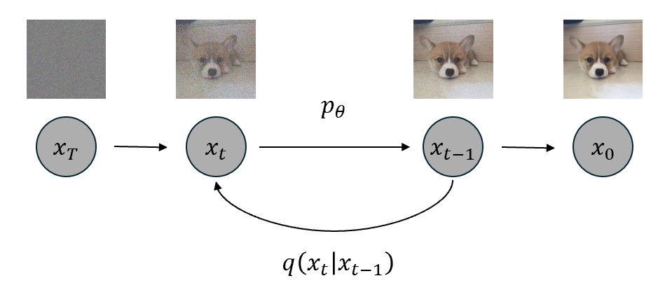
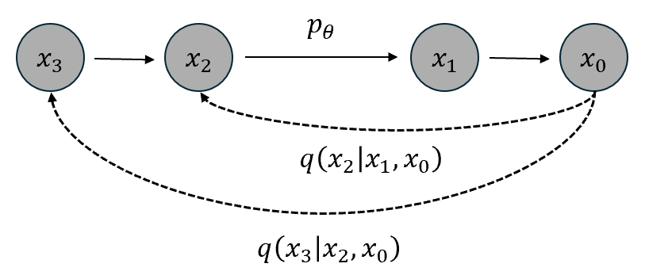
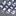
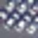
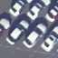

# SRDDIM: Super-Resolution Denoising Diffusion Implicit Models

This repository contains the implementation of the SRDDIM (Super-Resolution Denoising Diffusion Implicit Models) for image super-resolution.

## Overview

SRDDIM is a cutting-edge deep learning model that combines the strengths of super-resolution and denoising diffusion models to enhance the resolution and quality of low-resolution images. This method is particularly effective in producing realistic and high-quality images, making it suitable for applications in various fields such as medical imaging, satellite imaging, and more.

## Features

- Implementation of the SRDDIM architecture.
- Pre-trained models for quick inference.
- Scripts for training the SRDDIM model on custom datasets.
- Evaluation metrics for comparing performance with other super-resolution methods.

## Architecture

The SRDDIM model leverages the power of denoising diffusion models to iteratively refine and enhance the image resolution. The process involves adding noise to the low-resolution image and then using the model to denoise and super-resolve the image iteratively.

## Results

Example results obtained using the SRDDIM model:

| Low-Resolution Image | Super-Resolution Image | Ground Truth |
|----------------------|------------------------|--------------|
|  |  |  |

## References

- [Denoising Diffusion Implicit Models](https://arxiv.org/abs/2010.02502)
- [Super-Resolution Using Denoising Diffusion Probabilistic Models](https://arxiv.org/abs/2104.07636)

